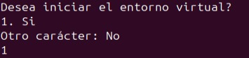

# Trabajo desarrollo web
el trabajo esta realizado por 
🎮 Joaquin Leonel Orlando
🕹️ Martín Alberto Villafañe
👾 Nicolás Ignacio Araujo

Con el tema dentro de la pagina web sentimos q el trabajo esta bien realizado y bastante bien guiado.
No haria falta una guia mas externa de mas q la misma informacion q muestra la pagina web. 

esperemos q les guste el diseño de la pagina.
Por mas q las ideas pricipales salieron de un template ya creado, tuvimos q rediseñar todos los textos y ademas de sumarle pedidos del trabajo practico fue algo complicado el poder adaptar nuestras ideas dentro del marco ya creado del template
# PERO
en el "crearentorno", talves puede ser algo confuso en el final

cuando entres al menu de crear entorno, es facil primero pedira el nombre de la carpeta en donde te gustaria crear el entorno(los template y static siempre va a ser igual el nombre)

pero luego van a salir muchas palabras raras(es solo el flask instalando), saldra mucho texto pero al final es lo importante

cuando dice q 1=si quiere decir q es el unico caracter q hara correr el entorno solamente el "1" acompañado de nadie 
no podra correr el entorno cualquier otro caracter o el "1" acompañado de cualquier cosa, hara q el entorno termine sin correrlo (ya q se cierra el bash) y habria q correrlo devuelta

cuando corra el bash devuelta pedira hacer carpetas nuevas si o si por el cual podrias abrir el entorno manual con un "source .venv/bin/activate" o correr denuevo el bash pero poniendo el mismo nombre a las carpetas (mi consejo el q escribe el readme es q corras el entorno manual).

fin del comunicado 

espero esto te ayude

